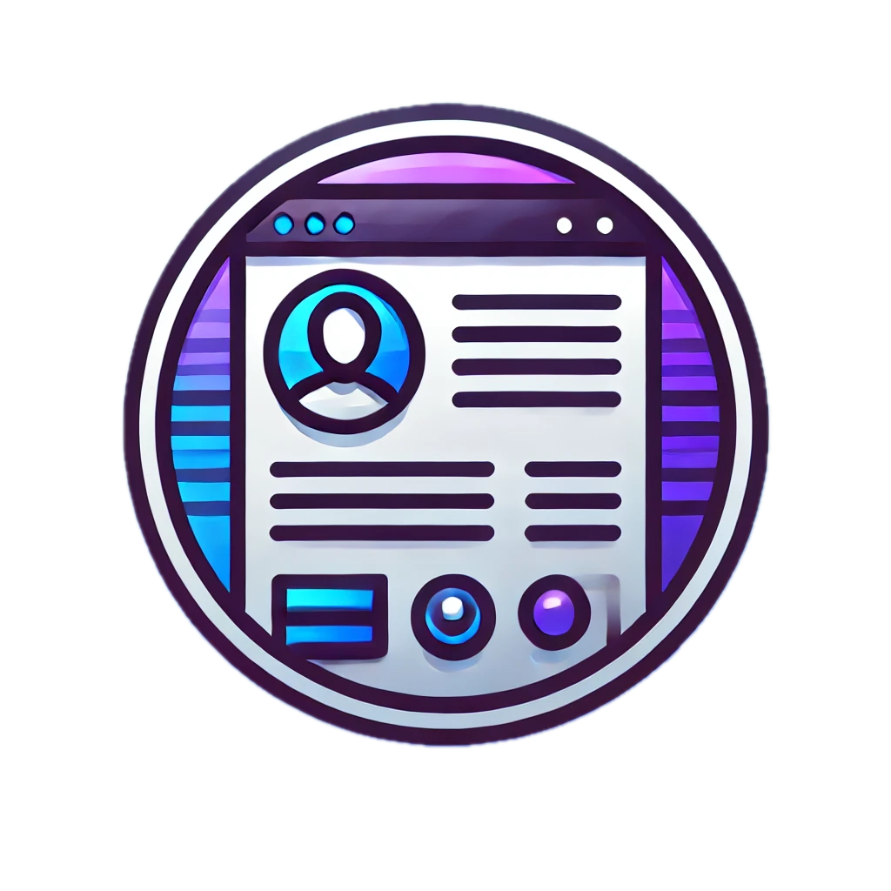

# Vue.js Multilanguage Portfolio Template

A modern, responsive portfolio template built with Vue 3, TypeScript, and Quasar Framework. Features smooth scrolling, animations, and multilanguage support.

## 🚀 Features

- 🌐 Multilanguage support (English/Italian)
- 📱 Fully responsive design
- 🎨 Clean and modern UI with Quasar Framework
- ⚡ Built with Vue 3 + Vite for optimal performance
- 💻 TypeScript for better code quality
- 🔄 Smooth scroll animations
- 🎯 Section-based layout
- 📊 Skills visualization
- 📝 Timeline for education and experience
- 🔧 Easy to customize and extend

## 🛠️ Tech Stack

- Vue 3
- TypeScript
- Quasar Framework
- Pinia (State Management)
- Vite
- ESLint
- Semantic Release

## 📦 Installation and Customize

1. Fork the repository
2. Clone the project
3. Install dependencies with `npm install`
4. Start the development server with `npm run dev`
5. Customize the content in `src/assets/` and `src/locale/translations`
